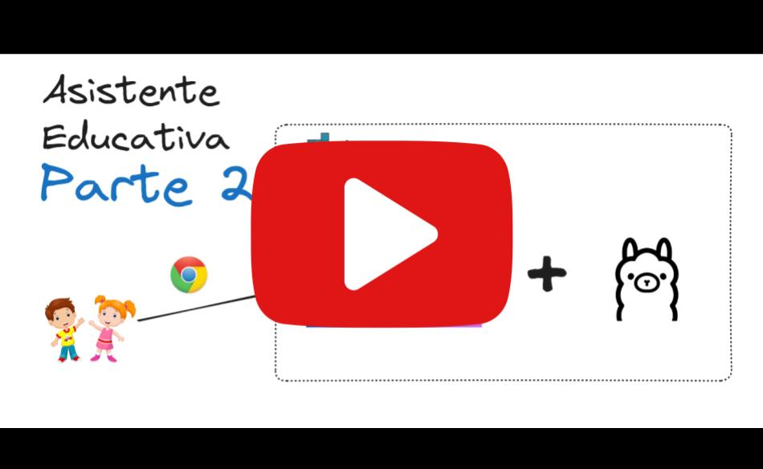

# Educational assistant for learning American countries' capitals

This project aims to develop an educational assistant designed to help children learn the capitals of American countries in an interactive and engaging way. Utilizing Llama3 and Ollama, we have created a chatbot that operates through a web interface, providing a user-friendly experience similar to ChatGPT. The project includes a comprehensive guide on setting up the environment, dockerizing Ollama and Flowise for a streamlined configuration, and a repository with all necessary installation and configuration steps. By integrating advanced technologies with educational content, we strive to transform traditional learning methods and make education more accessible and enjoyable for young learners.

---

# Installation guide

URL:
https://hub.docker.com/r/ollama/ollama

### Install Nvidia GPU (si aplica)

**Install Nvidia driver**

```bash
curl -fsSL https://nvidia.github.io/libnvidia-container/gpgkey | sudo gpg --dearmor -o /usr/share/keyrings/nvidia-container-toolkit-keyring.gpg

curl -s -L https://nvidia.github.io/libnvidia-container/stable/deb/nvidia-container-toolkit.list | sed 's#deb https://#deb [signed-by=/usr/share/keyrings/nvidia-container-toolkit-keyring.gpg] https://#g' | sudo tee /etc/apt/sources.list.d/nvidia-container-toolkit.list

sudo apt-get update

sudo apt-get install -y nvidia-container-toolkit
```

**Configure Docker to use Nvidia driver**

```bash
sudo nvidia-ctk runtime configure --runtime=docker
sudo systemctl restart docker
```

## Run the project container

This project install ollama and flowiser in the same container

1. `docker-compose up -d`
2. Open [http://localhost:3000](http://localhost:3000) to access **flowise**
3. Open [http://localhost:11434](http://localhost:11434) to access **ollama**
4. You can bring the containers down by `docker-compose stop`

When you run the docker-compose, the following containers are started:

-   agents
    -   ollama
    -   flowise

## Install the llama3 model

From the ollama API documentation:
https://github.com/ollama/ollama/blob/main/docs/api.md

You need to install the `llama3` model in ollama:

```bash
curl  -X POST 'http://localhost:11434/api/pull' -d '{"name": "llama3"}'
```

To verify that the model is installed, open [http://localhost:11434/api/tags](http://localhost:11434/api/tags)

# Guide to use the project

To start the project, run the following command:

```bash
docker-compose up -d
```

To stop the project, run the following command:

```bash
docker-compose stop
```

# Flowise Chatflow

This project uses the flowise chatflow to interact with the user. The chatflow is located in the root of the project in the file `AsistenteEducativa-llama3 Chatflow.json`. You can modify the chatflow by editing this file.

# Video tutorial

<!-- URL: https://www.youtube.com/watch?v=F2ESy4P3pFA  -->
<!-- video bg: video-img-github.jpg -->

[](https://www.youtube.com/watch?v=F2ESy4P3pFA)

Url: https://www.youtube.com/watch?v=F2ESy4P3pFA
